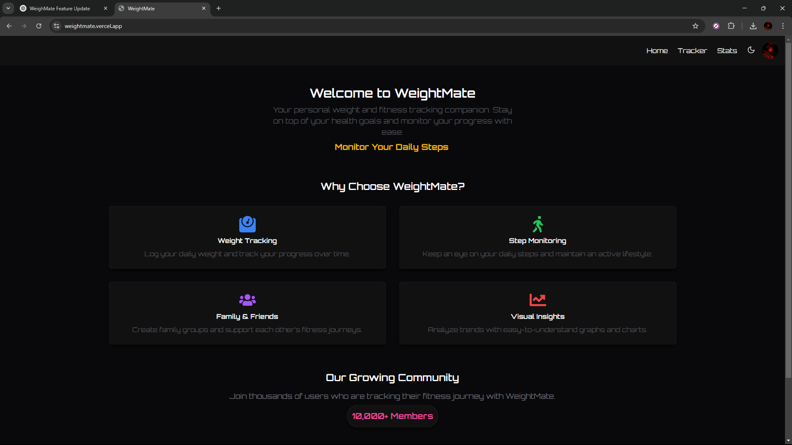
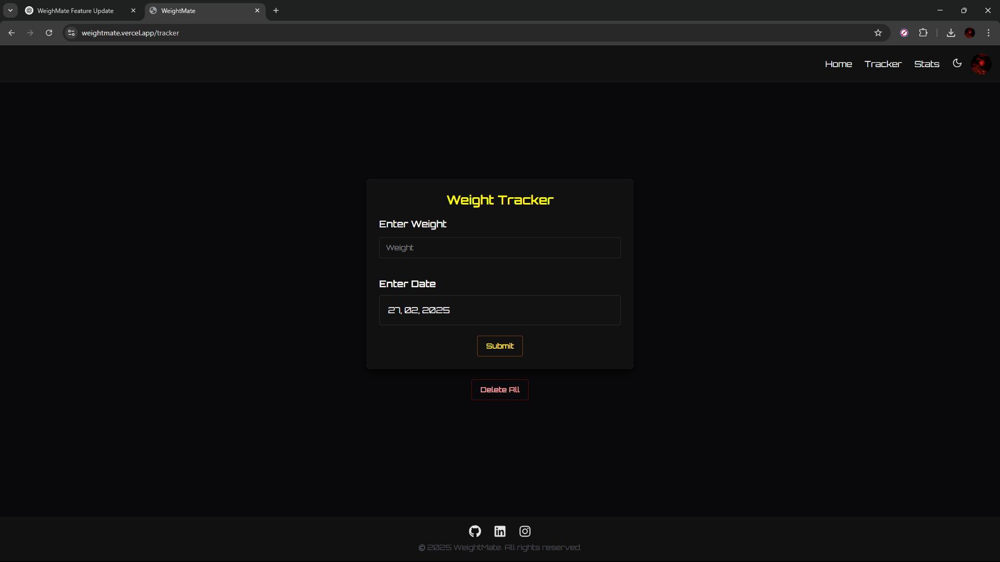
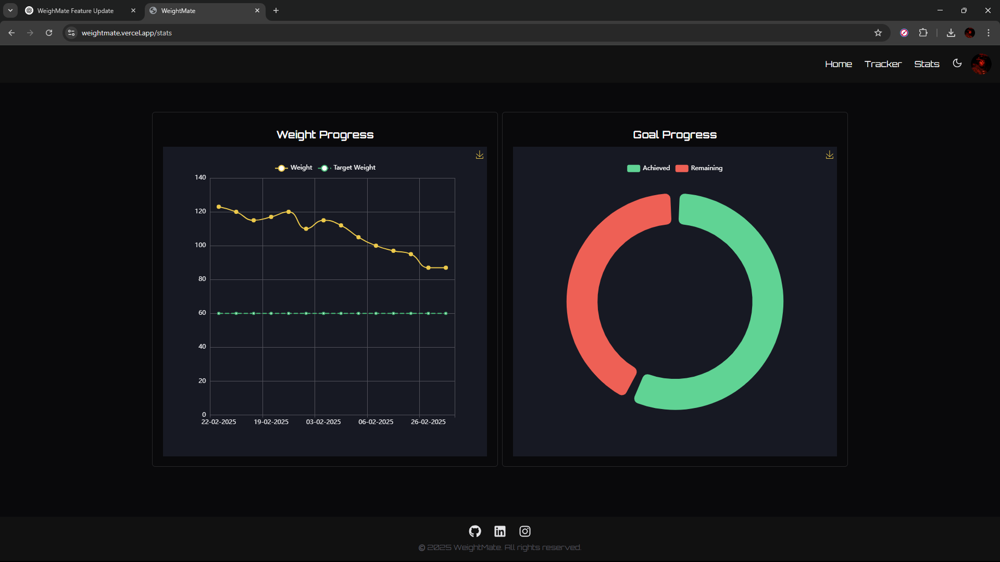

# WeighMate

[Project URL](https://weightmate.vercel.app/)

WeighMate is a free solution for managing and tracking weights. This project aims to provide an easy-to-use interface for users to log, monitor, and analyze weight data over time.

## Features

- User-friendly interface
- Log weight entries
- Analyze weight trends with charts and graphs

## Screenshots

### Home Page

### Tracker

### Stats

## Technology used

- **Backend     :**     
- **Frontend    :**         
- **Deployment  :**  
